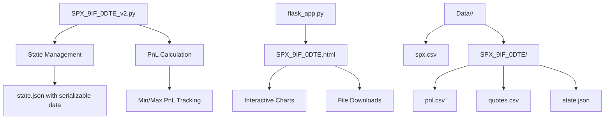

# Design Document

## Overview

This design addresses five key enhancements to the SPX 9IF 0DTE trading system:

1. **State Serialization Fix**: Resolve JSON serialization errors for Option objects in state persistence
2. **PnL Tracking Enhancement**: Add min/max net PnL tracking to state management
3. **Template Renaming**: Rename strategy.html to SPX_9IF_0DTE.html for consistency
4. **Chart Functionality**: Implement working charts with SPX data and fly position overlays
5. **File Download System**: Replace raw data display with downloadable file links

The system currently uses Flask for web interface, DXFeed for market data streaming, and CSV files for data persistence organized in `Data/<date>/` folders.

## Architecture

### Current System Components
- **SPX_9IF_0DTE_v2.py**: Main trading strategy with state management
- **flask_app.py**: Web interface serving GEX analysis and strategy dashboard
- **Data Structure**: `Data/<YYYY-MM-DD>/` containing `spx.csv` and `SPX_9IF_0DTE/` subfolder
- **Templates**: HTML templates for web interface rendering

### Enhanced Architecture
The design maintains the existing architecture while addressing specific issues:



## Components and Interfaces

### 1. State Serialization Component

**Problem**: Option objects contain non-serializable attributes causing JSON errors.

**Solution**: Custom serialization handler for Option objects.

**Interface**:
```python
def serialize_option(option_obj) -> dict:
    """Convert Option object to JSON-serializable dictionary"""
    
def deserialize_option(option_dict) -> Option:
    """Reconstruct Option object from dictionary"""
    
def save_state_with_serialization(state: StrategyState):
    """Save state with proper Option object handling"""
```

**Implementation Strategy**:
- Extract essential Option attributes (symbol, strike, expiry, option_type)
- Store as dictionary in state.json
- Reconstruct Option objects on state load using tastytrade API

### 2. PnL Tracking Enhancement

**Current**: State tracks `total_pnl` and `realized_pnl`
**Enhancement**: Add `min_net_pnl` and `max_net_pnl` fields

**Interface**:
```python
@dataclass
class StrategyState:
    # existing fields...
    min_net_pnl: float = 0.0
    max_net_pnl: float = 0.0
    
def update_pnl_extremes(current_net_pnl: float):
    """Update min/max PnL tracking"""
```

**Net PnL Calculation**:
- Net PnL = realized_pnl + unrealized_pnl
- Update extremes on every PnL calculation cycle
- Persist in state.json for restart safety

### 3. Template Renaming Component

**Changes Required**:
- Rename `templates/strategy.html` → `templates/SPX_9IF_0DTE.html`
- Update Flask route in `flask_app.py`
- Update any hardcoded template references

**Interface**:
```python
@app.route("/strategy")
def strategy():
    return render_template("SPX_9IF_0DTE.html", ...)
```

### 4. Chart Functionality Component

**Current Issue**: Chart displays but doesn't render data properly.

**Root Cause Analysis**:
- SPX data structure: `Time,Symbol,Bid Price,Ask Price,Mark Price`
- Chart expects time series with price data
- Missing proper data parsing and chart configuration

**Enhanced Chart Design**:

**Data Processing**:
```python
def prepare_chart_data(date: str) -> dict:
    """Prepare SPX and PnL data for Plotly charts"""
    spx_data = load_spx_data(date)
    pnl_data = load_pnl_data(date)
    return {
        'spx_trace': format_spx_trace(spx_data),
        'fly_traces': format_fly_traces(pnl_data),
        'current_pnl': get_current_pnl(date)
    }
```

**Chart Configuration**:
- Primary Y-axis: SPX Mark Price
- Secondary Y-axis: PnL values (SPX points)
- X-axis: Time (parsed from timestamps)
- Color coding: 9 distinct colors for fly positions
- Current PnL display: Top-right corner overlay

**Data Sources**:
- SPX: `Data/<date>/spx.csv` → Mark Price column
- Flies: `Data/<date>/SPX_9IF_0DTE/pnl.csv` → body and pnl columns
- Current PnL: Latest total_pnl from pnl.csv including realized losses

### 5. File Download System

**Current**: Raw CSV content displayed in HTML
**Enhancement**: Downloadable file links with date-specific routing

**Interface**:
```python
@app.route("/download/<date>/<file_type>")
def download_file(date: str, file_type: str):
    """Serve CSV files for download"""
    
def generate_download_url(date: str, file_type: str) -> str:
    """Generate download URL for specific date and file type"""
```

**File Types**:
- `pnl`: Downloads `Data/<date>/SPX_9IF_0DTE/pnl.csv`
- `quotes`: Downloads `Data/<date>/SPX_9IF_0DTE/quotes.csv`

**UI Components**:
- Replace raw text display with download buttons
- Date-aware file serving
- Error handling for missing files

## Data Models

### Enhanced StrategyState
```python
@dataclass
class StrategyState:
    entered_today: bool = False
    expiry: Optional[str] = None
    active_flies: Dict[float, dict] = field(default_factory=dict)  # serialized
    closed_flies: Dict[float, dict] = field(default_factory=dict)  # serialized
    per_if_pnl: Dict[float, float] = field(default_factory=dict)
    total_pnl: float = 0.0
    realized_pnl: float = 0.0
    min_net_pnl: float = 0.0  # NEW
    max_net_pnl: float = 0.0  # NEW
```

### Option Serialization Schema
```python
{
    "symbol": str,
    "strike": float,
    "expiry": str,
    "option_type": str,
    "streamer_symbol": str,
    # other essential attributes
}
```

### Chart Data Schema
```python
{
    "spx_trace": {
        "x": List[str],  # timestamps
        "y": List[float],  # mark prices
        "type": "scatter",
        "mode": "lines"
    },
    "fly_traces": List[{
        "x": List[str],
        "y": List[float],
        "name": str,  # "IF {body}"
        "color": str
    }],
    "current_pnl": float
}
```

## Error Handling

### State Serialization Errors
- Catch JSON serialization exceptions
- Log detailed error information
- Provide fallback state saving mechanism
- Validate state integrity on load

### Chart Data Errors
- Handle missing or malformed CSV files
- Provide empty chart with appropriate messaging
- Validate data types and ranges
- Graceful degradation for partial data

### File Download Errors
- Check file existence before serving
- Return appropriate HTTP status codes
- Provide user-friendly error messages
- Log download attempts and failures

## Testing Strategy

### Unit Tests
- State serialization/deserialization functions
- PnL calculation and extremes tracking
- Chart data preparation functions
- File download URL generation

### Integration Tests
- End-to-end state persistence cycle
- Chart rendering with real data
- File download functionality
- Template rendering with new name

### Data Validation Tests
- CSV file format validation
- State.json schema validation
- Chart data structure validation
- Option object reconstruction accuracy

### Error Scenario Tests
- Missing data files
- Corrupted state.json
- Invalid date parameters
- Network/file system errors

## Performance Considerations

### State Management
- Minimize state.json file size through selective serialization
- Implement lazy loading for Option object reconstruction
- Cache frequently accessed state data

### Chart Rendering
- Limit data points for large time series
- Implement client-side data decimation
- Use efficient Plotly configuration options

### File Downloads
- Stream large CSV files instead of loading into memory
- Implement proper HTTP caching headers
- Add file size limits and validation

## Security Considerations

### File Access
- Validate date parameters to prevent directory traversal
- Restrict file downloads to allowed directories
- Implement proper file path sanitization

### Data Exposure
- Ensure sensitive trading data is properly protected
- Implement appropriate access controls
- Log file access attempts

## Migration Strategy

### Phase 1: State Serialization Fix
- Implement Option serialization functions
- Update save_state() and load_state() methods
- Test with existing state files

### Phase 2: PnL Tracking Enhancement
- Add min/max fields to StrategyState
- Update PnL calculation logic
- Migrate existing state files

### Phase 3: Template Renaming
- Rename template file
- Update Flask routes
- Test all template references

### Phase 4: Chart Functionality
- Implement data preparation functions
- Update chart configuration
- Test with various data scenarios

### Phase 5: File Download System
- Implement download routes
- Update template with download buttons
- Test file serving functionality